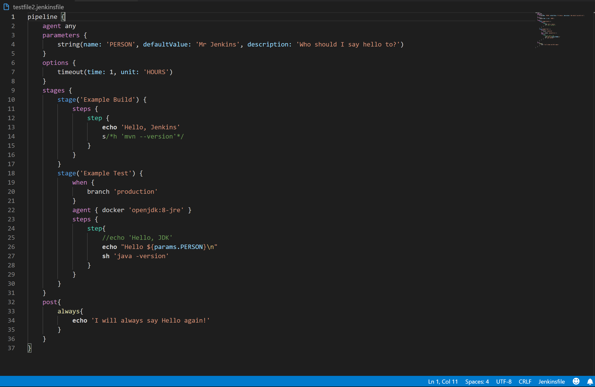

# jenkinsfile-support
## Features

Extension gives user basic jenkinsfile support.

* syntax highlighting
* snippets
* completion

## Release Notes
## [0.4.0]
- show hovers for basic keywords
- show autocompletion for basic keywords
### 0.2.0
* multiline comments
* tmp, stg, stp snippets
### 0.1.2
* aligning versions
### 0.1.1
* fix readme image path
### 0.1.0

* basic syntax highlighting